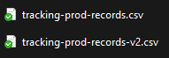
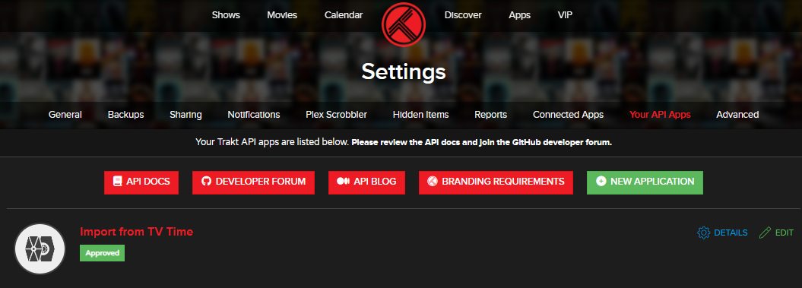
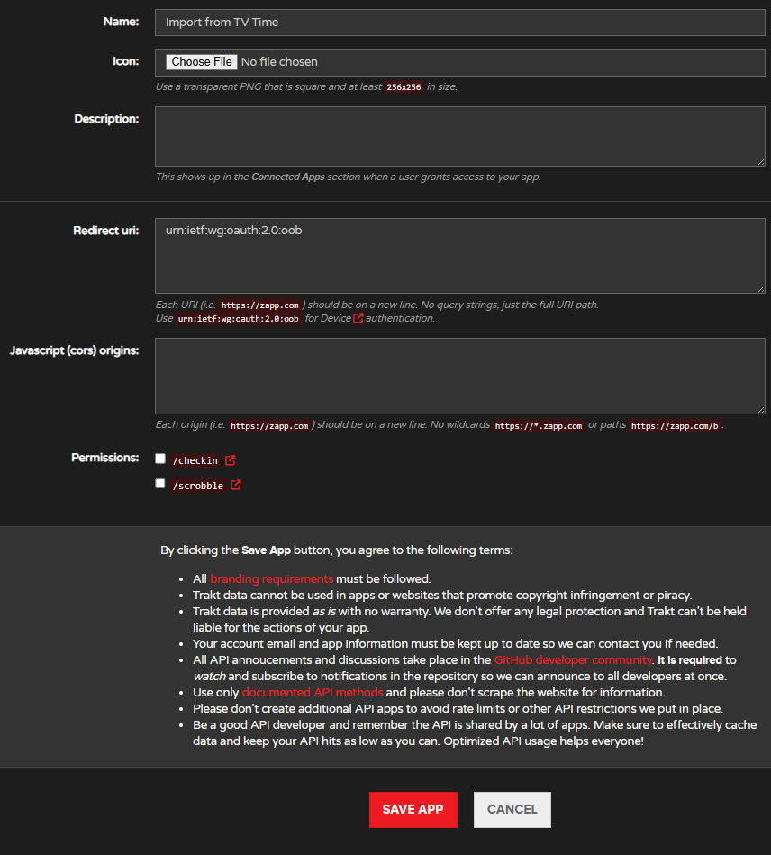
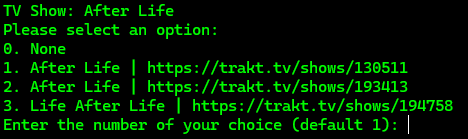
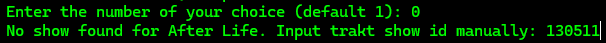
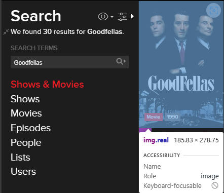
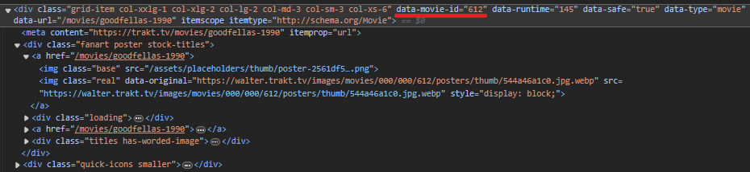

# TvTime2Trakt

<div align="center">
  
</div>

## Introduction

TvTime2Trakt is a console application designed to run on Windows.
It facilitates the import of your viewing data from TVTime to Trakt.tv, allowing you to synchronize your watched shows and movies across these platforms.

The first step is to get your data from TVTime by [issuing a GDPR request](https://tvtime.zendesk.com/hc/en-us/articles/360022148834-GDPR-Data-Requests-and-Removal).

It is important that the data you get from TVTime contains `tracking-prod-records.csv` and `tracking-prod-records-v2.csv`.



To use this application, you will need to create an [API app on Trakt.tv](https://trakt.tv/oauth/applications) to obtain necessary API credentials.



These credentials, specifically the Client ID and Client Secret, are required to configure the TvTime2Trakt application.

<details>
<summary>Trakt API App config</summary>



</details>

## Configuring `config.json`

Before running the TvTime2Trakt application, you need to set up your `config.json` file with your specific settings. Below is a description of each setting you need to configure:

1. **ClientId** - Your client ID from the Trakt.tv API.
2. **ClientSecret** - Your client secret from the Trakt.tv API.
3. **TvTimeDataFolder** - The local path to the folder containing your TvTime data, the contents of the extracted zip from TVTime
4. **ProgressFile** - The path to a file where the application can save its progress, to resume later if interrupted.
5. **IgnoreSkippedShows** - Set to `true` if you want to ignore shows you've skipped in previous runs; otherwise, set to `false`.
6. **IgnoreSkippedMovies** - Set to `true` if you want to ignore movies you've skipped in previous runs; otherwise, set to `false`.
7. **ConfirmationPromptBeforePost** - Set to `true` to receive a confirmation prompt before data is posted; otherwise, set to `false` and the process will run "automatically" if no conflicts are found. If a show/movie cannot directly be matched, a manual prompt will still appear.

### Sample `config.json`

```
{
  "ClientId": "abc123xyz",
  "ClientSecret": "def456uvw",
  "TvTimeDataFolder": "C:\\Users\\YourUsername\\Documents\\TvTimeData",
  "ProgressFile": "C:\\Users\\YourUsername\\Documents\\TvTime2TraktProgress.json",
  "IgnoreSkippedShows": false,
  "IgnoreSkippedMovies": false,
  "ConfirmationPromptBeforePost": true
}
```

Replace each placeholder with your actual data. For paths, ensure you use double backslashes (`\\`).

## Running the Application

After configuring your `config.json` file, you are ready to run the application by executing `TvTime2Trakt.exe`.

#### Manual selection

In cases where the TV show or movie cannot be matched automatically user input will be necessary.



You can click on the link to see which option is the correct one and make a selection by inputting the number of the option.

Default is `1` so you can just press enter to select option 1.

By selecting `0. None` you will be prompt to input the Trakt ID. 



In some cases no options will be found and the application will prompt for the Trakt ID. 

The easiest way I found to get the Trakt ID is to search for the show or movie in Trakt.



Then inspect the HTML code (`Ctrl+Shift+C` in Edge on Windows) on the cover image in the search results and look for the attribute `data-movie-id` for movies or `data-show-id` for shows.



 It should be a number, e.g. for Goodfellas `data-movie-id="612"` or for After Life `data-show-id="130511"`.


The application will start and begin processing the data based on your configuration. Follow any prompts on the screen to authorize the connection to Trakt.tv or confirm actions as per your settings.
